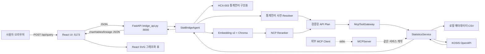
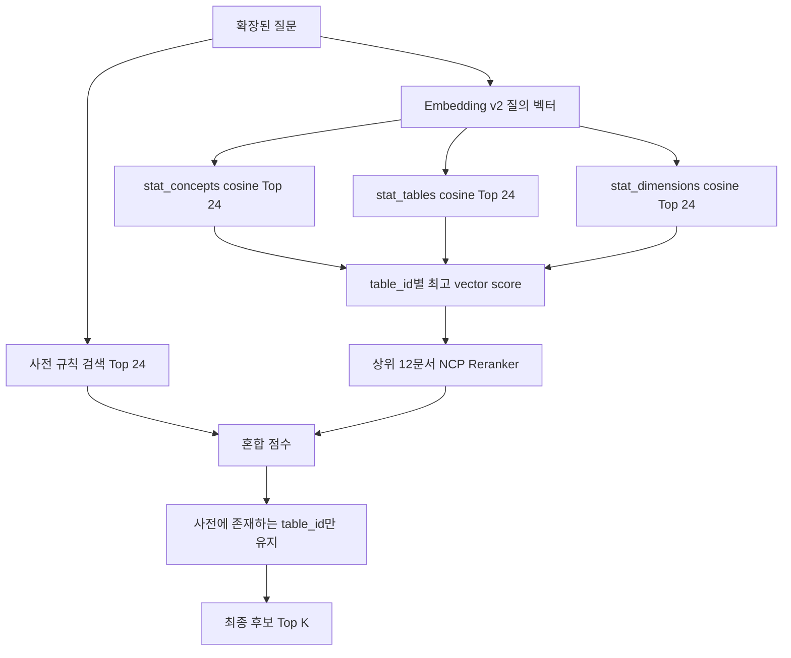
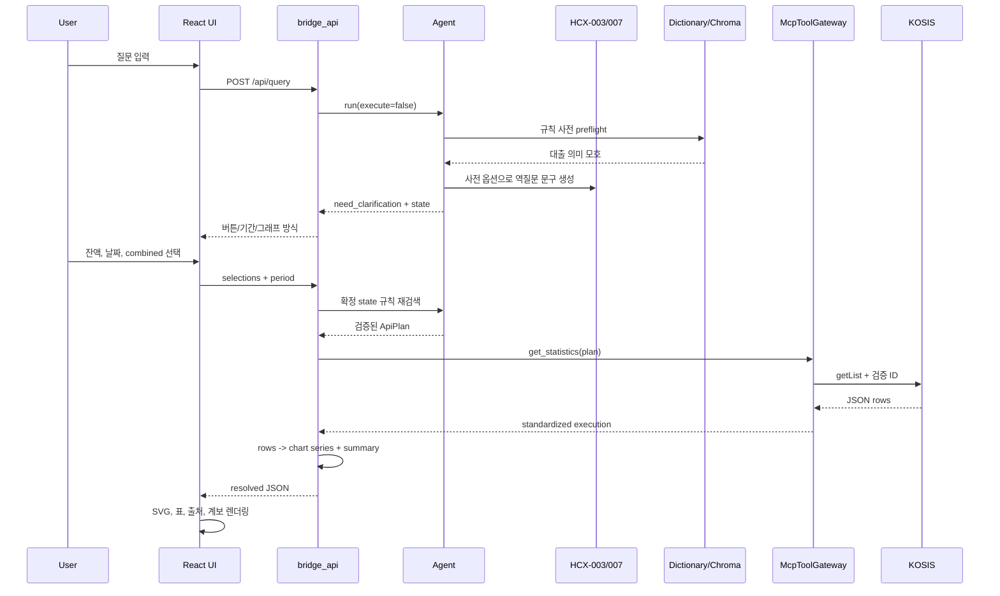

# StatBridge1 전체 구조와 데이터 흐름 상세 설명

## 0. 문서 목적과 기준

이 문서는 `StatBridge1`의 **현재 실제 코드**를 기준으로 다음 질문에 답한다.

1. 프로그램은 어떤 디렉터리와 프로세스로 구성되는가?
2. 자연어 질문은 어떻게 통계 검색용 언어로 바뀌는가?
3. 통계언어 사전에는 무엇이 들어 있으며 어떤 역할을 하는가?
4. 무엇을 임베딩하고 어디에 저장하는가?
5. 질문 임베딩은 저장된 임베딩과 어떻게 연결되는가?
6. 검색 결과는 어떻게 안전한 KOSIS API 계획으로 변환되는가?
7. MCP는 실제로 어느 지점에서, 어떤 방식으로 호출되는가?
8. KOSIS에서 받은 원시 행은 어떻게 그래프 데이터와 UI로 바뀌는가?

중요한 전제는 다음과 같다.

- 임베딩과 LLM은 `table_id`, `itmId`, `objL1` 같은 API 식별자를 새로 만들지 않는다.
- 실제 API 식별자는 `stat_language_dictionary.json`과 로컬 메타데이터에서만 가져온다.
- UI의 기본 실행 경로는 별도 MCP 프로세스와 stdio 통신하는 방식이 아니다. MCP 도구와 같은 `StatisticsService`를 `McpToolGateway`가 현재 Agent 프로세스 안에서 직접 호출한다.
- 별도로 실행되는 MCP 서버는 MCP Inspector나 외부 MCP 클라이언트가 stdio로 연결할 때 사용하는 진입점이다.
- 통계언어 사전을 처음 생성한 원본 생성기는 현재 이 패키지에 포함되어 있지 않다. 현재 저장소에는 완성된 사전과 그 사전을 임베딩하는 빌더가 들어 있다.

---

## 1. 한눈에 보는 전체 구조



핵심 계층은 다음과 같다.

| 계층 | 핵심 파일 | 책임 |
|---|---|---|
| 실행기 | `START_STATBRIDGE.cmd`, `runtime_scripts/*.cmd` | Python/Node 준비, 프로세스 시작, 포트와 헬스 확인 |
| UI | `frontend/src/App.tsx` | 질문 입력, 버튼·기간·그래프 방식 선택, 결과 출력 |
| UI API 클라이언트 | `frontend/src/api/client.ts` | `/api/query`, `/api/catalog` 호출과 연결 실패 처리 |
| HTTP 브리지 | `src/agent/bridge_api.py` | UI 계약, 기간 검증, Agent 실행, 차트 JSON 가공 |
| Agent | `src/agent/statbridge_agent.py` | HCX, 사전, 벡터 검색, API 계획, 데이터 실행 조정 |
| 규칙 검색 | `stat_dictionary/stat_language_resolver.py` | 사전 점수, 모호성 탐지, 버튼 역질문, ID 선택 |
| 벡터 검색 | `hybrid_retriever.py` | 질의 임베딩, Chroma 검색, Reranker, 혼합 점수 |
| NCP 클라이언트 | `ncp_clova_client.py`, `ncp_retrieval_client.py` | HCX-003/007, Embedding v2, Reranker HTTP 호출 |
| MCP 호환 게이트웨이 | `mcp_gateway.py` | MCP 도구와 같은 메서드로 StatisticsService 직접 호출 |
| MCP stdio 서버 | `statbridge_mcp_server/statbridge_mcp/server.py` | 외부 MCP 클라이언트에 도구 공개 |
| 통계 서비스 | `statistics_service.py` | 메타데이터, 로컬 CSV, KOSIS 조회와 결과 표준화 |
| 메타데이터 | `metadata_store.py`, `runtime_data/processed/*.csv` | 표·항목·분류·기간·주석·출처의 정규 구조 생성 |
| KOSIS 클라이언트 | `kosis_client.py` | 인증, rate limit, Parameter OpenAPI 요청 |
| 임베딩 빌더 | `tools/build_stat_vector_index.py` | 사전을 3종 문서로 바꾸고 Chroma 인덱스 생성 |

---

## 2. 디렉터리별 역할

```text
StatBridge1/
├─ START_STATBRIDGE.cmd
├─ STOP_STATBRIDGE.cmd
├─ runtime_scripts/
│  ├─ RUN_AGENT.cmd
│  ├─ RUN_MCP.cmd
│  └─ RUN_FRONTEND.cmd
├─ runtime_data/
│  ├─ processed/
│  │  ├─ bok_table_master.csv
│  │  ├─ bok_items.csv
│  │  ├─ bok_classifications.csv
│  │  ├─ bok_periods.csv
│  │  ├─ bok_comments.csv
│  │  └─ bok_sources.csv
│  └─ tables/                 # 로컬 수치 CSV가 있을 때 사용하는 위치
├─ statbridge_mcp_server/
│  ├─ .env
│  ├─ requirements.txt
│  ├─ server.py
│  └─ statbridge_mcp/
│     ├─ config.py
│     ├─ server.py
│     ├─ metadata_store.py
│     ├─ search_engine.py
│     ├─ statistics_service.py
│     └─ kosis_client.py
└─ StatBridge-official/
   ├─ data/
   │  ├─ vector_documents/
   │  │  ├─ stat_concepts.json
   │  │  ├─ stat_tables.json
   │  │  ├─ stat_dimensions.json
   │  │  └─ embedding_cache.json
   │  └─ vector_store/
   │     ├─ chroma.sqlite3
   │     └─ <collection-id>/HNSW files
   ├─ tools/
   │  ├─ build_stat_vector_index.py
   │  └─ evaluate_retrieval.py
   ├─ eval/retrieval/*.json
   └─ src/agent/
      ├─ bridge_api.py
      ├─ statbridge_agent.py
      ├─ hybrid_retriever.py
      ├─ ncp_clova_client.py
      ├─ ncp_retrieval_client.py
      ├─ mcp_gateway.py
      ├─ stat_dictionary/
      │  ├─ stat_language_dictionary.json
      │  ├─ clarification_groups.csv
      │  └─ stat_language_resolver.py
      └─ frontend/
         ├─ src/App.tsx
         ├─ src/api/client.ts
         ├─ src/api/types.ts
         └─ src/styles.css
```

현재 데이터 규모는 다음과 같다.

| 파일/저장소 | 현재 수량 | 의미 |
|---|---:|---|
| 통계언어 사전의 `tables` | 347 | Agent가 선택할 수 있는 검증 통계표 |
| 역질문 그룹 | 11 | 금리·대출처럼 모호한 질문의 선택 버튼 규칙 |
| `bok_table_master.csv` | 349행 | 원본 표 메타데이터 |
| `bok_items.csv` | 347행 | 통계 항목 ID와 이름 |
| `bok_classifications.csv` | 22,932행 | 분류 차원과 분류값 |
| `bok_periods.csv` | 666행 | 표별 주기와 제공 기간 |
| `bok_comments.csv` | 2,290행 | 주석 |
| `bok_sources.csv` | 349행 | 조사·담당 출처 |
| 임베딩 캐시 | 1,005개 고유 문서 해시 | 같은 텍스트의 중복 API 호출 방지 |
| 임베딩 벡터 차원 | 1,024 | NCP CLOVA Embedding v2 결과 차원 |

메타데이터 원본 349개 중 OpenAPI 지원 여부와 사전 교집합을 적용한 347개가 UI/Agent에서 사용된다.

---

## 3. 실행할 때 생성되는 프로세스

`START_STATBRIDGE.cmd`는 다음 순서로 동작한다.

1. `%~dp0`를 기준으로 패키지 루트를 계산한다. 따라서 한글·공백이 있는 다른 경로에 복사해도 절대경로가 고정되지 않는다.
2. Python 3.11~3.14를 탐색한다.
3. 없으면 Windows Package Manager인 `winget`으로 Python 3.12를 설치하고 실행기를 다시 연다.
4. 복사된 `.venv`는 사용하지 않고 `statbridge_mcp_server/.venv_runtime`을 해당 컴퓨터에서 생성한다.
5. `requirements.txt`의 FastAPI, MCP SDK, pandas, requests, chromadb 등을 검사하고 없으면 설치한다.
6. `.env`에서 KOSIS와 NCP 키의 존재 여부를 검사한다.
7. Node.js와 npm을 확인하고, 없으면 Node.js LTS 설치를 시도한다.
8. 프런트 `node_modules/.bin/vite.cmd`가 없으면 `npm install`을 실행한다.
9. 기존 StatBridge 창과 8000/5173 포트를 정리한다.
10. Agent API, MCP stdio 서버, Vite 프런트를 별도 창으로 시작한다.
11. `/api/health`와 프런트 HTTP 200을 실제 확인한 뒤 브라우저를 연다.

실행 결과는 세 프로세스로 나뉜다.

- **Agent API**: FastAPI, `127.0.0.1:8000`
- **Frontend**: Vite/React, `127.0.0.1:5173`
- **MCP Server**: stdio 서버, 네트워크 포트를 사용하지 않음

`.env`는 `statbridge_mcp_server/.env`에서 읽는다. 주요 변수는 다음과 같다.

```dotenv
KOSIS_API_KEY=...
NCP_CLOVA_API_KEY=...
NCP_CLASSIFIER_MODEL=HCX-003
NCP_MAIN_MODEL=HCX-007
STATBRIDGE_HYBRID_RETRIEVAL=1
STATBRIDGE_VECTOR_TOP_K=24
STATBRIDGE_RERANK_TOP_K=12
STATBRIDGE_MIN_FINAL_SCORE=0.42
STATBRIDGE_MIN_SCORE_GAP=0.06
```

---

## 4. 통계 메타데이터와 통계언어 사전의 차이

두 데이터는 비슷해 보이지만 목적이 다르다.

### 4.1 로컬 메타데이터 CSV

`MetadataStore`는 `runtime_data/processed`의 CSV를 읽어 `TableMetadata` 객체를 만든다.

- `bok_table_master.csv`: `TBL_ID`, 표 이름, 기관, 경로, 상태
- `bok_items.csv`: `ITM_ID`, 항목명
- `bok_classifications.csv`: `OBJ_ID`, `OBJ_ID_SN`, `OBJ_NM`, `ITM_ID`, `ITM_NM`, 상위 분류, 단위
- `bok_periods.csv`: `PRD_SE`, 시작·종료 시점
- `bok_comments.csv`: 주석 유형과 본문
- `bok_sources.csv`: 조사명, 부서, 연락처

`MetadataStore._build_index()`는 분류 행을 `OBJ_ID_SN` 순서로 묶어 다음 구조로 바꾼다.

```json
{
  "dimension_index": 1,
  "mcp_param": "objL1",
  "obj_id": "원본 object id",
  "obj_name": "사람이 읽는 분류명",
  "values": [
    {
      "class_id": "KOSIS 분류값 ID",
      "class_name": "분류값 이름",
      "parent_class_id": null,
      "unit_name": "단위"
    }
  ]
}
```

이 데이터는 표가 실제로 존재하는지, 어떤 ID를 호출할 수 있는지, 기간과 단위가 무엇인지 확인하는 **사실 데이터**다.

### 4.2 통계언어 사전

`stat_language_dictionary.json`은 자연어를 API 호출 가능한 표에 연결하기 위한 **검색·라우팅 데이터**다. 최상위에는 다음 영역이 있다.

- `metadata`
- `normalization`
- `frequency_lexicon`
- `analysis_intent_lexicon`
- `time_expression_lexicon`
- `qualifier_lexicon`
- `concept_lexicon`
- `tables`
- `routing_examples`
- `clarification_policy`
- `clarification_groups`
- `ambiguous_question_terms`
- `query_state_schema`
- `response_contracts`

각 `tables[]` 항목에는 다음 정보가 들어 있다.

| 필드 | 역할 |
|---|---|
| `table_id`, `table_name` | 검증된 통계표 식별자와 이름 |
| `domains` | 금리, 통화, 대출, 물가 같은 대분류 |
| `aliases` | 공식명 변형 |
| `semantic_aliases` | 일상어·유사 개념 |
| `public_query_terms` | 실제 질문 형태의 표현 |
| `keywords` | 검색용 키워드 |
| `prd_se` | M/Q/Y 등 주기 |
| `period_start_observed`, `period_end_observed` | 관측 제공 기간 |
| `item_ids`, `item_names`, `units` | 통계 항목과 단위 |
| `dimensions[]` | `objL1..8`에 연결되는 분류 차원 |
| `dimensions[].values[]` | 분류값 ID, 공식명, 쉬운 표현, 관련·제외 개념 |
| `api_call_params` | 검증된 KOSIS 호출 템플릿 |
| `clarification_tags` | 어떤 역질문 그룹과 연결되는지 표시 |

분류값은 단순 이름뿐 아니라 다음 언어층을 가진다.

```json
{
  "value_id": "13102...",
  "value_name": "제조업",
  "normalized": "제조업",
  "natural_language_terms": ["제조업", "제조업체", "제조기업"],
  "aliases": ["제조업", "제조업체"],
  "layman_terms": ["공장에서 물건 만드는 업종"],
  "related_concepts": ["산업"],
  "negative_terms": ["서비스업"],
  "value_question_terms": []
}
```

이 구조 덕분에 “공장에서 물건 만드는 회사 대출” 같은 표현도 `제조업` 분류값으로 연결할 수 있다.

---

## 5. 통계언어 사전의 규칙 검색

`StatLanguageResolver`가 사전을 메모리에 읽고 `tables_by_id` 인덱스를 만든다.

### 5.1 문자열 정규화

`norm()`은 다음 작업을 한다.

1. Unicode NFKC 정규화
2. 소문자 변환
3. 숫자, 영문, 한글, `%` 이외 문자를 공백으로 변경
4. 연속 공백 축소

따라서 띄어쓰기나 일부 기호 차이가 후보 검색을 지나치게 방해하지 않는다.

### 5.2 후보 점수

`_score()`는 347개 표를 순회하며 다음 근거를 합산한다.

- 확정 버튼 값: 기본 220점
- 사전에 정의한 공개 의도 규칙: 약 80~110점
- 정확한 `table_id`: 120점
- 표 이름 포함: 70점
- 공식 별칭: 20점
- 의미 별칭: 9점
- 공개 질문 문장: 28점 또는 토큰 중첩 점수
- 분류값 공식명: 최대 22점
- 분류값 별칭: 최대 18점
- 쉬운 표현: 최대 15점
- 관련 개념: 최대 6점
- 표 이름과 질문 토큰 중첩: 토큰당 3점
- 최신 기간 보너스: 2026이면 10점, 2025이면 6점
- 부정어 충돌: 감점

`_matches_metric_intent()`는 넓은 별칭 때문에 잘못 섞이기 쉬운 표를 먼저 차단한다. 예를 들어 질문에 `예금금리`가 있으면 수신금리 계열이 아닌 표를 제거하고, `비중` 질문이면 비중·구성 계열이 아닌 표를 제거한다.

최소 규칙 점수 기본값은 25다. 결과는 점수 내림차순, 동점이면 `table_id` 순으로 정렬된다.

### 5.3 역질문

`clarification_groups`는 “금리”, “대출”, “물가”처럼 여러 통계 개념으로 갈라지는 표현을 정의한다.

1. 질문이 그룹의 `trigger_terms`와 일치하는지 확인한다.
2. 이미 사용자가 확정한 그룹이나 이미 물어본 그룹은 건너뛴다.
3. `skip_if_terms`가 있으면 불필요한 역질문을 생략한다.
4. 각 옵션의 `table_name_any`와 `table_name_none` 조건으로 실제 표가 있는지 확인한다.
5. 실행 가능한 후보가 없는 버튼은 UI에 보내지 않는다.
6. 선택값은 `state.confirmed`에 저장되고 다음 검색에서 220점짜리 하드 앵커가 된다.

현재 정책에는 Top-1 180점, Top-1/Top-2 차이 40점 등의 값이 있지만, 명시적인 모호성 그룹이 감지되면 높은 점수보다 역질문을 우선한다.

---

## 6. HCX-003은 무엇을 하는가

`NcpClovaClient.classify_stat_language()`는 사용자 자연어를 JSON 통계언어로 구조화한다.

입력 예:

```text
최근 5년 동안 기준금리와 대출금리를 비교해줘
```

목표 출력 형태:

```json
{
  "normalized_query": "최근 5년 기준금리 대출금리 추이 비교",
  "concepts": ["기준금리", "대출금리"],
  "subjects": [],
  "measures": ["금리"],
  "time_terms": ["최근 5년"],
  "comparison_terms": ["추이", "비교"],
  "qualifiers": [],
  "series": [
    {"label": "기준금리", "query": "한국은행 기준금리"},
    {"label": "대출금리", "query": "예금은행 대출금리"}
  ]
}
```

안전 규칙은 시스템 프롬프트에 직접 들어 있다.

- 통계표 ID를 추측하지 않는다.
- `itmId`, `objL` 코드를 만들지 않는다.
- 숫자 데이터를 추측하지 않는다.
- JSON 객체 하나만 출력한다.

Agent는 `normalized_query`, `concepts`, `subjects`, `measures`, `time_terms`, `comparison_terms`, `qualifiers`를 중복 제거하여 원질문 뒤에 붙인다. 이 확장 문자열이 사전과 벡터 검색에 사용된다.

HCX 호출이 실패하거나 키가 없으면 원질문 그대로 규칙 검색을 계속한다.

### HCX-007의 현재 역할

HCX-007은 사전이 이미 결정한 버튼 목록을 바탕으로 자연스러운 역질문 한 문장을 만드는 데 사용된다. 선택지를 추가하거나 제거할 권한은 없다.

수치 결과 설명용 `answer_with_data()`도 구현되어 있지만, 현재 UI 그래프 실행은 속도와 근거 통제를 위해 `generate_answer=False`로 호출한다. 실제 화면 요약은 `bridge_api._chart_summary()`의 결정적 계산으로 만든다.

---

## 7. 무엇을 임베딩하는가

임베딩 빌더는 `tools/build_stat_vector_index.py`다. 입력은 완성된 `stat_language_dictionary.json`이다.

각 통계표마다 3개의 서로 다른 검색 문서를 만든다.

### 7.1 `stat_concepts`

포함 내용:

- `domains`
- `aliases`
- `semantic_aliases`
- `public_query_terms`

문서 예시 형태:

```text
통계표 산업별대출금(예금은행 기업규모별) |
개념 및 별칭: deposits_loans; 산업별대출금; 기업대출; 대출금; ...
```

이 컬렉션은 “사용자가 어떤 개념을 말했는가”를 찾는 데 유리하다.

### 7.2 `stat_tables`

포함 내용:

- `table_id`
- `table_name`
- `prd_se`
- `item_names`
- `units`

문서 예시 형태:

```text
통계표ID DT_131Y018 | 이름 산업별대출금(예금은행 기업규모별) |
주기 Q | 항목 산업별대출금(예금은행 기업규모별) | 단위 십억원
```

이 컬렉션은 표 이름, 항목, 주기, 단위 수준의 검색에 유리하다.

### 7.3 `stat_dimensions`

각 차원의 다음 값을 모은다.

- `normalized`
- `value_name`
- `aliases`
- `layman_terms`
- `related_concepts`

문서 예시 형태:

```text
통계표 산업별대출금(예금은행 기업규모별) |
분류값 objL1: 산업별대출금; 제조업; 건설업; 서비스업; ... |
objL2: 대기업; 중소기업; 개인사업자; ...
```

이 컬렉션은 “제조업”, “작은 회사”, “서비스 회사” 같은 세부 분류 표현을 찾는 데 유리하다.

### 7.4 임베딩 API와 저장

각 문서는 NCP CLOVA Studio Embedding v2로 전달된다.

```http
POST /v1/api-tools/embedding/v2/
Authorization: Bearer <NCP key>
Content-Type: application/json

{"text": "문서 문자열"}
```

응답의 `result.embedding`을 실수 배열로 변환한다. 현재 저장된 벡터는 1,024차원이다.

각 문서의 SHA-256을 계산해 `embedding_cache.json`에 저장한다. 문장이 바뀌지 않았으면 API를 다시 호출하지 않고 캐시 벡터를 재사용한다. 현재 캐시는 1,005개의 고유 문서 해시를 가진다. 표는 347개이고 표당 문서는 3개이므로 논리 문서 수는 최대 1,041개지만, 동일 문자열·기존 빌드 상태에 따라 고유 캐시 엔트리 수와 다를 수 있다.

Chroma에는 다음 값으로 upsert한다.

```json
{
  "id": "concept:DT_131Y018",
  "document": "임베딩한 원문",
  "metadata": {
    "table_id": "DT_131Y018",
    "table_name": "산업별대출금(예금은행 기업규모별)"
  },
  "embedding": [0.0123, -0.0456, "... 1024차원"]
}
```

세 컬렉션 모두 `hnsw:space = cosine`으로 생성된다. 디스크에는 `chroma.sqlite3`와 컬렉션별 HNSW 바이너리 파일이 저장된다.

빌드 명령은 다음과 같다.

```powershell
RUN_VECTOR_BUILD.cmd
```

또는 내부적으로:

```powershell
python StatBridge-official\tools\build_stat_vector_index.py
```

`--documents-only`는 임베딩 호출 없이 문서 JSON만 만들고, `--rebuild`는 기존 벡터 저장소와 캐시를 새로 만든다. `--limit`는 소량 smoke test에 사용한다.

---

## 8. 임베딩한 데이터와 사용자 질문을 연결하는 방법

온라인 검색은 `HybridStatRetriever.rank()`가 담당한다.



세부 과정은 다음과 같다.

1. 같은 질문으로 규칙 검색을 먼저 수행한다. 기본 후보 폭은 24다.
2. 질의를 Embedding v2에 보내 1,024차원 벡터를 만든다.
3. 세 Chroma 컬렉션 각각에 `query_embeddings=[query_vector]`를 보낸다.
4. 컬렉션마다 cosine 거리 기준 Top 24를 받는다.
5. `vector_score = max(0, 1 - distance)`로 변환한다.
6. 같은 `table_id`가 여러 컬렉션에 나오면 가장 높은 벡터 점수와 해당 문서를 사용한다.
7. 벡터 점수 상위 12개 문서를 NCP Reranker에 보낸다.
8. Reranker가 반환한 `citedDocuments` 순위를 1.0에서 순차적으로 낮아지는 점수로 바꾼다.
9. 규칙·벡터·재랭킹 점수를 합친다.

현재 최종 점수식은 다음과 같다.

```text
rule_norm = min(1, rule_score / 220)

final_score =
    0.34 × vector_score
  + 0.28 × rerank_score
  + 0.38 × rule_norm
  + confirmed_bonus
  - negative_penalty
```

확정 버튼 근거가 있으면 `confirmed_bonus = 0.12`가 추가된다.

### 가장 중요한 안전 연결

Chroma metadata에서 나온 `table_id`는 반드시 `resolver.tables_by_id`에 있는지 검사한다.

```text
벡터 결과 table_id
        ∩
통계언어 사전의 검증된 table_id
        ↓
후보 허용
```

따라서 임베딩 문서가 오염되거나 유사도 검색이 엉뚱한 값을 반환해도 사전에 없는 ID로 KOSIS를 호출할 수 없다. 벡터 저장소에는 검색 단서만 있고, 최종 API 계획은 사전 원본에서 다시 만든다.

Embedding/Reranker/Chroma에서 예외가 발생하면 `HybridStatRetriever`는 규칙 검색 결과로 복귀한다.

---

## 9. 질문 하나가 표 하나로 확정되는 순서

`StatBridgeAgent.resolve()`의 실제 순서는 다음과 같다.

### 9.1 첫 질문

1. 원질문을 규칙 Resolver에 먼저 넣는다.
2. “금리”처럼 명시적 모호성 그룹이 있으면 HCX가 의미를 확대하기 전에 버튼 질문을 만든다.
3. 모호성이 없으면 HCX-003으로 통계언어를 구조화한다.
4. HCX 결과를 원질문에 붙여 `dictionary_query`를 만든다.
5. HCX가 2~5개의 `series`를 만들었으면 각 series를 독립 검색한다.
6. 단일 계열이면 Hybrid Retriever로 후보를 생성한다.
7. Resolver의 안전한 모호성 판정을 유지하면서 최종 후보 순위에 하이브리드 후보를 반영한다.
8. 선택 표로 `ApiPlan`을 만든다.

### 9.2 버튼 선택 후

UI가 보내는 `selections[]`는 `bridge_api._resolve_selected_options()`에서 처리한다.

- 각 그룹은 복수 선택할 수 있다.
- 여러 그룹이면 선택값의 조합을 만든다.
- 최대 5개 조합까지만 그래프 계획으로 만든다.
- 각 조합은 `state.confirmed`에 넣고 규칙 Resolver로 다시 확인한다.
- 이 단계에서는 이미 확정된 상태를 재사용하므로 HCX 분류, 질의 임베딩, Reranker를 다시 호출하지 않는다.
- `(table_id, item_id, classifications)`가 같은 계획은 중복 제거한다.

선택이 바뀔 때 UI는 `execute:false` 미리보기를 보내 해당 선택 조합의 정확한 제공 기간을 받아 날짜 입력기의 `min`/`max`를 갱신한다.

---

## 10. 검증된 KOSIS API 계획을 만드는 방법

`StatBridgeAgent.build_api_plan()`은 후보에 있는 `table_id`로 사전 원본 표를 다시 읽는다.

### 10.1 기본 식별자

- `table_id`: 선택 후보의 검증 ID
- `org_id`: 사전의 기관 ID, 없으면 `301`
- `item_id`: `api_call_params.itmId`, 없으면 첫 `item_ids`, 그래도 없으면 `ALL`
- `frequency`: `api_call_params.prdSe` 또는 표의 `prd_se`

### 10.2 기간

질문에 “최근 5년”, “최근 12개월”, “2024년” 같은 표현이 있으면 주기에 맞게 변환한다.

- 월: `YYYYMM`
- 분기: `YYYY01`~`YYYY04`
- 반기: `YYYY01`~`YYYY02`
- 연: `YYYY`

질문에 기간이 없으면 전체 데이터를 무조건 가져오지 않고 추세를 볼 수 있는 안전 기본 범위를 사용한다.

- 월: 최근 12개 관측 구간
- 분기: 최근 8개 관측 구간
- 연: 최근 5년

UI에서 정확한 날짜를 선택하면 `bridge_api._api_period()`가 HTML 날짜를 통계 주기로 다시 바꾼다. 선택 날짜가 원자료 범위를 벗어나면 서버에서도 실제 범위로 보정한다.

### 10.3 분류값

`_merge_classifications()`는 각 분류 차원에서 첫 번째 검증 값을 대표값으로 사용한다. 일반적으로 합계·전체에 해당한다. 질문에서 분류값을 찾은 경우 해당 차원의 값만 `dimension_hits.value_id`로 교체한다.

이 방식은 모든 산업 × 모든 기업규모의 거대한 조합을 가져온 뒤 같은 날짜끼리 덮어쓰던 문제를 방지한다.

### 10.4 계획 결과

```json
{
  "table_id": "DT_131Y018",
  "table_name": "산업별대출금(예금은행 기업규모별)",
  "org_id": "301",
  "item_id": "13103136163999",
  "frequency": "Q",
  "start_period": "202401",
  "end_period": "202602",
  "classifications": {
    "objL1": "검증된 대표 또는 선택 분류 ID",
    "objL2": "검증된 대표 또는 선택 분류 ID"
  },
  "exact_params": {
    "method": "getList",
    "format": "json",
    "jsonVD": "Y",
    "smblChk": "Y",
    "orgId": "301",
    "tblId": "DT_131Y018",
    "itmId": "13103136163999",
    "prdSe": "Q",
    "startPrdDe": "202401",
    "endPrdDe": "202602",
    "objL1": "...",
    "objL2": "..."
  }
}
```

API 키는 계획 JSON에 박아 두지 않고 KOSIS 클라이언트가 `.env`에서 읽어 요청할 때 추가한다.

---

## 11. MCP를 어떻게 호출하는가

여기에는 서로 다른 두 경로가 있다.

### 11.1 UI가 사용하는 인프로세스 MCP 호환 경로

FastAPI 시작 시 다음 객체가 한 프로세스에 만들어진다.

```python
service = StatisticsService()
mcp_gateway = McpToolGateway(service)
agent = StatBridgeAgent(service=mcp_gateway)
```

Agent는 다음처럼 호출한다.

```python
data = self.service.get_statistics(
    table_id=plan["table_id"],
    item_id=plan["item_id"],
    classifications=plan["classifications"],
    frequency=plan["frequency"],
    start_period=plan["start_period"],
    end_period=plan["end_period"],
    prefer_local=False,
    allow_fallback=False,
)
```

여기서 `self.service`의 실제 객체는 `McpToolGateway`다. Gateway는 인자를 바꾸지 않고 같은 프로세스의 `StatisticsService.get_statistics()`로 전달한다.

이 방식의 장점:

- 매 질문마다 MCP stdio 서브프로세스를 만들지 않는다.
- 직렬화·역직렬화와 프로세스 시작 비용이 없다.
- 외부 MCP 도구와 같은 서비스 계약을 유지한다.

즉 화면의 “MCP” 단계는 **MCP 도구 계약을 통과했다**는 뜻이고, UI 요청마다 별도 stdio 메시지를 보냈다는 뜻은 아니다.

### 11.2 외부 클라이언트가 사용하는 실제 MCP stdio 경로

`statbridge_mcp_server/statbridge_mcp/server.py`는 `MCPServer("StatBridge-MCP")`를 만들고 다음 도구를 공개한다.

| 도구 | 입력 | 출력/역할 |
|---|---|---|
| `healthcheck` | 없음 | 키, 경로, 지원 표 수 |
| `search_tables` | `query`, `top_k` | 메타데이터 기반 후보 표 |
| `get_table_metadata` | `table_id`, fallback 여부 | 항목·분류·기간·주석·출처 |
| `get_statistics` | 표/항목/분류/주기/기간 | 실제 수치 행 |
| `validate_tables_batch` | offset, limit | 표를 작은 묶음으로 검증 |
| `validate_all_tables` | limit | 전체 호환 검증 |

`RUN_MCP.cmd`가 `server.py`를 실행하면 `mcp.run()`이 stdio transport를 연다. 외부 MCP Inspector가 JSON-RPC/MCP 방식으로 이 프로세스에 연결할 수 있다.

두 경로 모두 최종적으로 같은 `StatisticsService`를 사용하므로 메타데이터와 KOSIS 처리 규칙은 같다.

---

## 12. StatisticsService가 데이터를 가져오는 과정

### 12.1 초기화

`StatisticsService`는 다음 구성요소를 가진다.

- `MetadataStore`: CSV 메타데이터 인덱스
- `SearchEngine`: 메타데이터 토큰 기반 검색
- `KosisClient`: 실제 OpenAPI 클라이언트
- `tables_dir`: 로컬 수치 CSV 디렉터리

API 키가 없을 때 UI 서버는 `_NoKeyClient`를 넣어 메타데이터·사전 탐색은 유지하고 실제 수치 호출만 명확히 실패시킨다.

### 12.2 로컬 CSV와 KOSIS 우선순위

MCP 공개 도구 `get_statistics()`의 기본값은 `prefer_local=True`다.

1. 로컬 표 CSV를 찾는다.
2. 표 ID, 항목 ID, 분류값, 주기, 기간으로 필터링한다.
3. 행이 있으면 `source="local_csv"`로 반환한다.
4. 없으면 KOSIS OpenAPI를 호출한다.

현재 UI Agent는 최신 원자료를 위해 명시적으로 `prefer_local=False`를 보낸다. 따라서 UI 그래프는 KOSIS를 바로 호출한다.

### 12.3 UI와 외부 MCP의 fallback 차이

StatisticsService에는 요청 ID 실패 시 `ALL`이나 첫 실제 분류값으로 다시 시도하는 여러 fallback 조합이 있다. 그러나 UI Agent는 `allow_fallback=False`를 전달한다.

이유는 다음과 같다.

- 사전이 이미 검증한 정확한 ID를 사용한다.
- 빈 결과를 다른 표준으로 넓혀 잘못된 그래프를 만드는 것을 막는다.
- 여러 번의 45초 네트워크 timeout이 누적되는 것을 막는다.

외부 MCP의 공개 함수에는 `allow_fallback` 인자가 노출되지 않아 서비스 기본 동작을 사용한다.

### 12.4 KOSIS HTTP 요청

`KosisClient.get_statistics()`는 다음 URL을 사용한다.

```text
https://kosis.kr/openapi/Param/statisticsParameterData.do
```

기본 파라미터:

```text
method=getList
apiKey=<환경변수 키>
format=json
jsonVD=Y
smblChk=Y
orgId=<기관>
tblId=<표 ID>
itmId=<항목 ID>
prdSe=<주기>
startPrdDe=<시작>
endPrdDe=<종료>
objL1..objL8=<분류값>
```

빈 `objL`은 보내지 않는다. 분당 호출 수 제한과 0.35~0.65초 임의 간격을 적용하며 기본 timeout은 45초다.

KOSIS가 JSON 객체 형태의 오류를 보내면 `KosisApiError(code, message)`로 변환한다. 정상 응답은 행 배열이어야 한다.

### 12.5 서비스 표준 응답

```json
{
  "source": "kosis_api",
  "status": "success",
  "attempt": "requested",
  "table_id": "DT_...",
  "table_name": "...",
  "used_params": {
    "item_id": "...",
    "classifications": {"objL1": "..."},
    "frequency": "M",
    "start_period": "202401",
    "end_period": "202612"
  },
  "row_count": 36,
  "rows": [
    {
      "PRD_DE": "202401",
      "DT": "123.4",
      "UNIT_NM": "%",
      "ITM_NM": "통계 항목",
      "C1_NM": "분류값"
    }
  ]
}
```

---

## 13. 여러 그래프 계열을 실행하는 방법

`execute_resolution()`은 `api_plans`를 순서대로 실행한다.

1. 각 계획에 UI 기간 override를 반영한다.
2. 계획별로 Gateway의 `get_statistics()`를 호출한다.
3. 반환된 각 행에 `_SERIES_LABEL`을 추가한다.
4. 모든 행을 `all_rows`에 합친다.
5. 출처별 `table_id`와 행 수를 `sources`에 기록한다.

```json
{
  "status": "success",
  "rows": ["모든 계열의 행"],
  "row_count": 120,
  "sources": [
    {"table_id": "DT_A", "row_count": 60},
    {"table_id": "DT_B", "row_count": 60}
  ]
}
```

현재 최대 비교 조합은 5개다. 같은 계획은 중복 제거된다.

---

## 14. KOSIS 원시 행을 차트 JSON으로 바꾸는 방법

`bridge_api._chart_series()`가 변환한다.

### 14.1 유효 행 선별

- `DT`를 쉼표 제거 후 `float`로 바꿀 수 있어야 한다.
- `PRD_DE`가 비어 있지 않아야 한다.
- 숫자로 변환할 수 없는 기호·공란 행은 그래프에서 제외한다.

### 14.2 계열 이름 결정

1. Agent가 붙인 `_SERIES_LABEL`이 있으면 그것을 우선한다.
2. 없으면 `ITM_NM`으로 시작한다.
3. `C1_NM`부터 `C8_NM`까지 읽는다.
4. `전체`, `계`, `합계`는 이름에서 제외한다.
5. 단위는 `UNIT_NM`을 사용한다.

그룹 키는 `(계열명, 단위)`다.

### 14.3 날짜와 중복

각 점은 다음 형태다.

```json
{"date": "202401", "value": 3.5}
```

같은 계열에서 동일 시점이 중복되면 마지막 행을 남긴다. 계획 단계에서 차원당 하나의 대표값을 고르는 이유도 불필요한 동일 시점 충돌을 방지하기 위해서다.

### 14.4 최종 차트 구조

```json
{
  "id": "series-1",
  "label": "기준금리",
  "unit": "연%",
  "color": "#4568ff",
  "points": [
    {"date": "202401", "value": 3.5},
    {"date": "202402", "value": 3.5}
  ]
}
```

색상은 6색 팔레트를 순환한다.

### 14.5 요약문

`_chart_summary()`는 첫 계열의 첫 점과 마지막 점을 비교한다.

- 마지막 값 > 첫 값: 증가
- 마지막 값 < 첫 값: 감소
- 같음: 같은 수준 유지
- 여러 계열이면 총 계열 수를 덧붙임

원인이나 경제 해석을 추측하지 않고 그래프에 실제로 있는 값만 간단히 설명한다.

---

## 15. FastAPI 응답 상태별 UI 흐름

`POST /api/query` 응답은 대표적으로 다섯 상태를 가진다.

| 상태 | 의미 | UI 컴포넌트 |
|---|---|---|
| `need_clarification` | 지표·대상 선택 필요 | `ClarificationPanel` |
| `need_period` | 표는 확정, 날짜 필요 | `PeriodPanel` |
| `need_chart_mode` | 여러 계열의 배치 방식 필요 | `ChartModePanel` |
| `resolved` | 그래프 출력 가능 | `Results` |
| `no_match` | 사전에서 지원 표를 찾지 못함 | 경고/안전 응답 |

### `need_clarification`

포함 필드:

- 버튼 그룹과 옵션
- 대화 `state`
- 후보 통계표 카드
- 후보들의 공통 제공 기간
- HCX/사전/역질문 lineage

### `need_period`

포함 필드:

- 선택 가능한 `availablePeriod.min/max`
- 통계 주기
- 확정 통계표
- 선택 상태

### `resolved`

포함 필드:

- `summary`
- 실제 적용 기간과 사용 가능 기간
- `frequency`
- `chart[]`
- `tables[]`
- `insights[]`
- `lineage[]`
- `warnings[]`
- 디버그 계획, 행 미리보기, 단계별 시간

---

## 16. React UI가 API를 호출하는 방법

`frontend/src/api/client.ts`의 기본 API 주소는 다음과 같다.

```text
http://127.0.0.1:8000/api
```

환경변수 `VITE_API_BASE_URL`로 바꿀 수 있다. `VITE_USE_MOCK=true`이면 실제 서버 대신 mock 응답을 사용한다.

`submitQuery()`는 JSON POST를 보낸다.

```json
{
  "query": "대출 얼마나 늘었어?",
  "state": {},
  "selections": [
    {"clarification_id": "loan_measure", "values": ["잔액"]}
  ],
  "execute": true,
  "period_start": "2021-01-01",
  "period_end": "2026-06-30",
  "chart_mode": "combined"
}
```

Agent API 연결 실패 시 UI는 임의 통계값을 보여주지 않는다. `chart`와 `tables`를 비우고 “Agent API 연결 실패” 안전 응답으로 전환한다.

---

## 17. UI에서 그래프를 그리는 방법

`App.tsx`의 `LineChart`는 외부 차트 라이브러리가 아니라 SVG를 직접 만든다.

### 17.1 축 계산

1. 모든 계열의 날짜를 합쳐 중복 제거 후 정렬한다.
2. 모든 값의 최소·최대를 구한다.
3. 값 범위의 12%, 절댓값의 3%, 1 중 가장 큰 값을 padding으로 사용한다.
4. SVG viewBox는 기본 760×310이다.
5. 날짜 인덱스를 X 좌표로 선형 배치한다.
6. 값을 Y 범위에 선형 변환한다.

### 17.2 선과 점

- 각 계열의 점을 `M x,y L x,y ...` SVG path 문자열로 만든다.
- 각 관측치를 `<circle>`로 표시한다.
- 점의 `<title>`에 계열명, 값, 단위를 넣어 hover 정보를 제공한다.
- X축 라벨은 날짜 수에 따라 약 7개 간격으로 축약 표시한다.
- Y축은 5개 tick을 표시한다.

### 17.3 한 그래프와 여러 그래프

- `chartMode="combined"`: 모든 계열을 같은 `LineChart`에 전달한다.
- `chartMode="separate"`: 계열마다 `LineChart series={[s]}`를 만들어 각자의 Y축 범위를 사용한다.

서로 단위나 규모가 크게 다른 계열은 separate 모드가 해석에 더 안전하다.

### 17.4 부가 출력

`Results`는 그래프 외에 다음을 표시한다.

- 질문과 결정적 요약문
- 범례와 단위
- 실제 적용 기간과 주기
- 사용한 통계표 카드
- 데이터 계보 타임라인
- 모든 관측치 표
- CSV 다운로드

CSV는 브라우저에서 UTF-8 BOM을 붙여 생성하므로 한국어 Excel 호환성을 높인다.

---

## 18. 데이터 계보 카탈로그 흐름

`GET /api/catalog`은 통계언어 사전과 `MetadataStore.available_supported_tables()`의 교집합만 노출한다.

1. 사전의 domain을 대분류·중분류로 매핑한다.
2. 지원되는 347개 표를 대분류 → 중분류 → 소분류 구조로 만든다.
3. 표를 선택하면 주기, 제공 기간, 단위, 통계 항목, 사람 친화적인 분류 정보를 보여준다.
4. `objL1`, `itmId`, API URL, 전체 요청 파라미터 같은 내부 실행 정보는 사용자 카드에서 제거한다.

카탈로그는 검색 실행 경로와 같은 사전·메타데이터를 사용하므로 “화면에는 있지만 실제 호출할 수 없는 표”가 나타나는 것을 줄인다.

---

## 19. 전체 요청 시퀀스 예시

질문: `대출 얼마나 늘었어?`



첫 요청은 수치 API를 호출하지 않는다. 표와 기간이 확정된 뒤에만 KOSIS 수치 조회가 실행된다.

---

## 20. 성능 최적화 지점

현재 구현에 적용된 주요 최적화는 다음과 같다.

1. 버튼 선택 후 HCX 분류·Embedding·Reranker를 다시 실행하지 않는다.
2. 확정된 resolution을 `execute_resolution()`에 직접 전달한다.
3. UI 그래프에서는 사용하지 않는 HCX-007 장문 수치 설명을 생성하지 않는다.
4. 단일 계열 요청에 모든 분류값의 Cartesian 조합을 보내지 않는다.
5. UI는 정확한 사전 ID 한 번만 호출하고 자동 fallback 재시도를 끈다.
6. 기간이 이미 명시되면 KOSIS 기간 메타데이터를 다시 조회하지 않는다.
7. 임베딩 빌드에는 SHA-256 캐시를 사용한다.
8. Chroma 컬렉션은 최초 접근 후 프로세스 메모리에 유지한다.

실제 검증에서 선택 이후 실행은 약 1.1초 수준이었고, 확정 계획 재해석은 약 8ms였다. 이 수치는 네트워크 상태와 KOSIS 응답에 따라 달라질 수 있다.

---

## 21. 실패와 fallback

| 실패 지점 | 현재 동작 |
|---|---|
| NCP 키 없음 | 규칙 사전 검색 유지, HCX/임베딩 비활성 |
| HCX-003 오류 | 원질문으로 검색 계속 |
| Chroma 없음/오류 | 규칙 검색으로 복귀 |
| Embedding/Reranker 오류 | 규칙 검색으로 복귀 |
| KOSIS 키 없음 | 메타데이터·카탈로그는 동작, 수치 호출 오류 |
| KOSIS 빈 결과/오류 | UI는 빈 그래프 또는 경고, 다른 ID를 임의 사용하지 않음 |
| Agent API 연결 실패 | UI 안전 응답, 가짜 통계값 미출력 |
| 범위 밖 날짜 | UI 선택 차단 + 서버에서 실제 제공 범위로 재보정 |
| 여러 표의 기간 불일치 | 공통 교집합 기간만 선택 가능 |

---

## 22. 테스트와 평가 자료

### Agent 흐름

```powershell
RUN_AGENT_TEST.cmd
RUN_AGENT_E2E_TEST.cmd
```

`TEST_AGENT_FLOW.py`는 HCX 구조화, 역질문, 사전 hard constraint, MCP 호출 인자, 답변 경로를 검사한다.

### NCP 모델 연결

```powershell
RUN_NCP_TEST.cmd
```

### 검색 평가

```powershell
RUN_RETRIEVAL_EVAL.cmd
```

평가셋:

- `single_table.json`
- `alias.json`
- `multi_table.json`
- `clarification.json`
- `no_match.json`

규칙 전용, 임베딩 전용, 하이브리드 검색을 비교할 수 있다. 최근 결과는 `last_results.json`에 저장된다.

### 프런트 빌드

```powershell
cd StatBridge-official\src\agent\frontend
npm run build
```

---

## 23. 현재 구현에서 꼭 알아야 할 한계

1. **사전 생성 원본 파이프라인 부재**: 현재 패키지에는 완성된 JSON 사전은 있지만 CSV에서 이 사전을 전부 재생성하는 스크립트는 없다. 사전 수정은 별도 생성 절차 또는 신중한 편집이 필요하다.
2. **대표 분류값 가정**: 질문에서 특정 분류를 찾지 못하면 각 차원의 첫 값이 합계·대표값이라고 가정한다. 표마다 첫 값의 의미를 검증하는 품질 관리가 필요하다.
3. **UI의 MCP 표현**: UI 데이터 계보에는 MCP 단계가 표시되지만 실제 UI 요청은 stdio가 아닌 인프로세스 Gateway다.
4. **결정적 요약의 범위**: 현재 요약은 첫 계열의 처음·마지막 값만 설명한다. 중간 고점, 변동성, 계열 간 상관관계는 설명하지 않는다.
5. **혼합 단위 그래프**: combined 모드에서 단위가 다른 계열도 하나의 Y축에 놓일 수 있다. 이 경우 separate 모드를 권장한다.
6. **벡터는 후보 생성용**: 임베딩 유사도가 높아도 사전 규칙과 ID 검증을 통과해야 한다. 이는 의도적인 안전 설계다.
7. **외부 API 의존성**: 최초 임베딩 빌드와 실시간 KOSIS 조회는 인터넷·API 키·외부 서비스 상태의 영향을 받는다.

---

## 24. 핵심 요약

StatBridge1의 핵심은 “LLM이 통계 ID를 만들어 호출하는 시스템”이 아니다.

정확한 구조는 다음과 같다.

```text
자연어
→ HCX-003이 통계 개념으로 구조화
→ 규칙 사전 + 3종 임베딩 인덱스 + Reranker가 후보 생성
→ 후보 table_id를 검증 사전과 교집합 확인
→ 사전에서 itmId/objL/주기/기간을 꺼내 ApiPlan 생성
→ MCP와 같은 계약의 Gateway가 StatisticsService 호출
→ StatisticsService가 KOSIS OpenAPI 호출
→ 원시 PRD_DE/DT 행을 계열·점 구조로 변환
→ FastAPI가 UI 응답 계약으로 전달
→ React가 SVG 그래프, 표, 출처, 데이터 계보로 출력
```

임베딩은 “어떤 통계표가 질문과 의미상 가까운가”를 찾고, 통계언어 사전은 “그 통계표를 어떤 검증된 ID로 정확히 호출할 것인가”를 결정한다. 두 기능을 분리한 것이 전체 구조의 가장 중요한 안전장치다.
